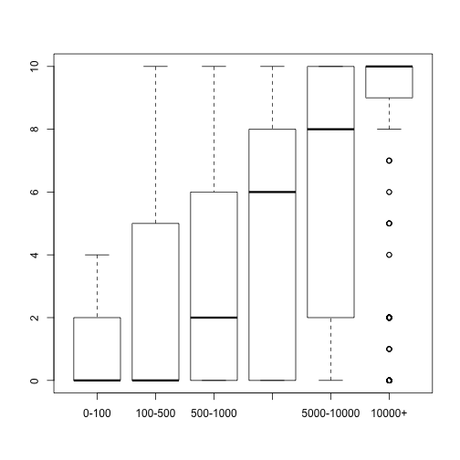
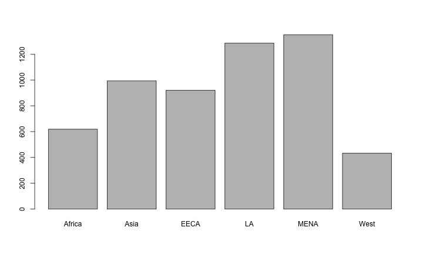
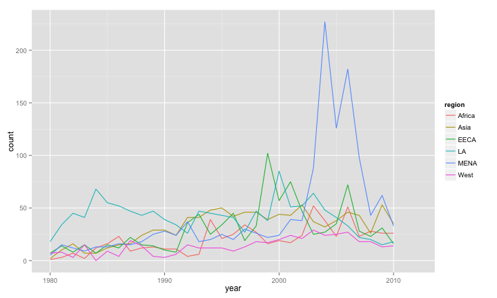

A Demonstration of R
========================================================

As researchers, we often want to go through a basic workflow:

1. Collect data
2. Describe or summarize it
3. Visualize it
4. Analyze it, or test some causal inference. 

# Setup environment


```r
# remove all objects
rm(list=ls())

# set wd
setwd(dir="/Users/rterman/Dropbox/berkeley/Programming-resources/R-hacker-within")
```

# Construct a dataset

The first thing we want to do is construct a dataset. This might involve mergingother datasets that we have locally or through an API, package, etc.

First lets load the packages that allow us to import data.


```r
# load data from .csv format using foreign:
library("foreign")

# find country codes using the country code package.
library("countrycode")

# use the World Bank Development Indicator dataset using its API:
library("WDI")
```

```
## Loading required package: RJSONIO
```

The first thing we want to do is load some of the data we want to work with.

```r
polity <- read.csv("Data/Polity/p4v2013.csv")
polity[1:15,1:10]
```

```
##      cyear ccode scode     country year flag fragment democ autoc polity
## 1  7001800   700   AFG Afghanistan 1800    0       NA     1     7     -6
## 2  7001801   700   AFG Afghanistan 1801    0       NA     1     7     -6
## 3  7001802   700   AFG Afghanistan 1802    0       NA     1     7     -6
## 4  7001803   700   AFG Afghanistan 1803    0       NA     1     7     -6
## 5  7001804   700   AFG Afghanistan 1804    0       NA     1     7     -6
## 6  7001805   700   AFG Afghanistan 1805    0       NA     1     7     -6
## 7  7001806   700   AFG Afghanistan 1806    0       NA     1     7     -6
## 8  7001807   700   AFG Afghanistan 1807    0       NA     1     7     -6
## 9  7001808   700   AFG Afghanistan 1808    0       NA     1     7     -6
## 10 7001809   700   AFG Afghanistan 1809    0       NA     1     7     -6
## 11 7001810   700   AFG Afghanistan 1810    0       NA     1     7     -6
## 12 7001811   700   AFG Afghanistan 1811    0       NA     1     7     -6
## 13 7001812   700   AFG Afghanistan 1812    0       NA     1     7     -6
## 14 7001813   700   AFG Afghanistan 1813    0       NA     1     7     -6
## 15 7001814   700   AFG Afghanistan 1814    0       NA     1     7     -6
```

```r
ciri <- read.csv("Data/CIRI/CIRI_1981_2011.csv")
ciri[1:15,1:10]
```

```
##     X        CTRY YEAR CIRI COW POLITY UNCTRY UNREG UNSUBREG PHYSINT
## 1   1 Afghanistan 1981  101 700    700      4   142       62       0
## 2   2 Afghanistan 1982  101 700    700      4   142       62       0
## 3   3 Afghanistan 1983  101 700    700      4   142       62       0
## 4   4 Afghanistan 1984  101 700    700      4   142       62       0
## 5   5 Afghanistan 1985  101 700    700      4   142       62       0
## 6   6 Afghanistan 1986  101 700    700      4   142       62       0
## 7   7 Afghanistan 1987  101 700    700      4   142       62       0
## 8   8 Afghanistan 1988  101 700    700      4   142       62       0
## 9   9 Afghanistan 1989  101 700    700      4   142       62       0
## 10 10 Afghanistan 1990  101 700    700      4   142       62       0
## 11 11 Afghanistan 1991  101 700    700      4   142       62       1
## 12 12 Afghanistan 1992  101 700    700      4   142       62      NA
## 13 13 Afghanistan 1993  101 700    700      4   142       62      NA
## 14 14 Afghanistan 1994  101 700    700      4   142       62      NA
## 15 15 Afghanistan 1995  101 700    700      4   142       62      NA
```

Let's start with the Polity dataset on political regime characteristics and transitions. We'll want to subset, and maybe alter some values.


```r
# find column names
names(polity)
```

```
##  [1] "cyear"    "ccode"    "scode"    "country"  "year"     "flag"    
##  [7] "fragment" "democ"    "autoc"    "polity"   "polity2"  "durable" 
## [13] "xrreg"    "xrcomp"   "xropen"   "xconst"   "parreg"   "parcomp" 
## [19] "exrec"    "exconst"  "polcomp"  "prior"    "emonth"   "eday"    
## [25] "eyear"    "eprec"    "interim"  "bmonth"   "bday"     "byear"   
## [31] "bprec"    "post"     "change"   "d4"       "sf"       "regtrans"
```

```r
# subset the data
rt <- subset(polity, year>1979 & year < 2013,select=c(ccode,scode,country,year,polity,polity2,democ,autoc))

# take a look
rt[1:15,]
```

```
##     ccode scode     country year polity polity2 democ autoc
## 181   700   AFG Afghanistan 1980    -66      NA   -66   -66
## 182   700   AFG Afghanistan 1981    -66      NA   -66   -66
## 183   700   AFG Afghanistan 1982    -66      NA   -66   -66
## 184   700   AFG Afghanistan 1983    -66      NA   -66   -66
## 185   700   AFG Afghanistan 1984    -66      NA   -66   -66
## 186   700   AFG Afghanistan 1985    -66      NA   -66   -66
## 187   700   AFG Afghanistan 1986    -66      NA   -66   -66
## 188   700   AFG Afghanistan 1987    -66      NA   -66   -66
## 189   700   AFG Afghanistan 1988    -66      NA   -66   -66
## 190   700   AFG Afghanistan 1989     -8      -8     0     8
## 191   700   AFG Afghanistan 1990     -8      -8     0     8
## 192   700   AFG Afghanistan 1991     -8      -8     0     8
## 193   700   AFG Afghanistan 1992    -77       0   -77   -77
## 194   700   AFG Afghanistan 1993    -77       0   -77   -77
## 195   700   AFG Afghanistan 1994    -77       0   -77   -77
```

```r
# give a summary of a column
summary(rt$polity)
```

```
##    Min. 1st Qu.  Median    Mean 3rd Qu.    Max. 
## -88.000  -7.000   4.000  -1.833   9.000  10.000
```

```r
# apply NA values
rt$polity[rt$polity < -10] <- NA
summary(rt$polity)
```

```
##    Min. 1st Qu.  Median    Mean 3rd Qu.    Max.    NA's 
## -10.000  -6.000   5.000   1.808   9.000  10.000     239
```

```r
# delete records
rt <- rt[-which(rt$country=="Sudan-North"),]
```

Some packages are available that offer data. For instance, the `countrycode` package offers a database of various codes used to identify countries -- e.g. from the UN, WorldBank, etc. It does this through a function. We can add new variables by passing other variables into this function.


```r
# worldbank
rt$worldbank <- countrycode(rt$ccode,"cown","wb") #worldbank

# iso2c 
rt$iso2c <- countrycode(rt$worldbank,"wb","iso2c") #iso2c

# find NAs
unique(rt$country[is.na(rt$worldbank)])
```

```
##  [1] Czechoslovakia Ethiopia       Germany East   Germany West  
##  [5] Montenegro     Serbia         South Sudan    USSR          
##  [9] Vietnam        Yemen North    Yemen South   
## 194 Levels: Afghanistan Albania Algeria Angola Argentina ... Zimbabwe
```

```r
# assign codes
rt$worldbank[rt$country=="Germany West"] <- "DE"
```

Let's say we want to quickly reorder our columns:


```r
##### Re-Order Columns
names(rt)
```

```
##  [1] "ccode"     "scode"     "country"   "year"      "polity"   
##  [6] "polity2"   "democ"     "autoc"     "worldbank" "iso2c"
```

```r
rt <- rt[,c(4,3,1,2,9,10,5,6,7,8)]
names(rt)
```

```
##  [1] "year"      "country"   "ccode"     "scode"     "worldbank"
##  [6] "iso2c"     "polity"    "polity2"   "democ"     "autoc"
```

Now we that we have these codes to serve as identifiers, we can merge our dataset with another dataset that uses the same codes. Let's do the popular CIRI dataset on political violence.


```r
names(ciri)
```

```
##  [1] "X"          "CTRY"       "YEAR"       "CIRI"       "COW"       
##  [6] "POLITY"     "UNCTRY"     "UNREG"      "UNSUBREG"   "PHYSINT"   
## [11] "DISAP"      "KILL"       "POLPRIS"    "TORT"       "OLD_EMPINX"
## [16] "NEW_EMPINX" "ASSN"       "FORMOV"     "DOMMOV"     "OLD_MOVE"  
## [21] "SPEECH"     "ELECSD"     "OLD_RELFRE" "NEW_RELFRE" "WORKER"    
## [26] "WECON"      "WOPOL"      "WOSOC"      "INJUD"      "ccode"
```

```r
ciri$X <- NULL
names(ciri)
```

```
##  [1] "CTRY"       "YEAR"       "CIRI"       "COW"        "POLITY"    
##  [6] "UNCTRY"     "UNREG"      "UNSUBREG"   "PHYSINT"    "DISAP"     
## [11] "KILL"       "POLPRIS"    "TORT"       "OLD_EMPINX" "NEW_EMPINX"
## [16] "ASSN"       "FORMOV"     "DOMMOV"     "OLD_MOVE"   "SPEECH"    
## [21] "ELECSD"     "OLD_RELFRE" "NEW_RELFRE" "WORKER"     "WECON"     
## [26] "WOPOL"      "WOSOC"      "INJUD"      "ccode"
```

```r
# subset
ciri.subset <- subset(ciri, YEAR > 1979 & YEAR < 2013, select=c(YEAR,COW,UNREG,PHYSINT,SPEECH,NEW_EMPINX,WECON,WOPOL,WOSOC,ELECSD))

# rename
names(ciri.subset) <- c("year","ccode","unreg","physint","speech","new_empinx","wecon","wopol","wosoc","elecsd")

# merge
rt <- merge(rt,ciri.subset,by=c("year","ccode"),all.x=TRUE,incomparables=NA)

# delete duplicates
duplicates <- which(duplicated(rt))
rt <- rt[-duplicates,]
```

Let's add more data. The WorldBank has a package, `WDI` that allows you to search and extract data from the World Bank's World Development Indicators API. Let's use it to get the gdp for each country.


```r
# Search World Bank Development Indicators
WDIsearch(string="gdp per capita")
```

```
##       indicator             
##  [1,] "GDPPCKD"             
##  [2,] "GDPPCKN"             
##  [3,] "NV.AGR.PCAP.KD.ZG"   
##  [4,] "NY.GDP.PCAP.CD"      
##  [5,] "NY.GDP.PCAP.KD"      
##  [6,] "NY.GDP.PCAP.KD.ZG"   
##  [7,] "NY.GDP.PCAP.KN"      
##  [8,] "NY.GDP.PCAP.PP.CD"   
##  [9,] "NY.GDP.PCAP.PP.KD"   
## [10,] "NY.GDP.PCAP.PP.KD.ZG"
## [11,] "SE.XPD.PRIM.PC.ZS"   
## [12,] "SE.XPD.SECO.PC.ZS"   
## [13,] "SE.XPD.TERT.PC.ZS"   
##       name                                                                 
##  [1,] "GDP per Capita, constant US$, millions"                             
##  [2,] "Real GDP per Capita (real local currency units, various base years)"
##  [3,] "Real agricultural GDP per capita growth rate (%)"                   
##  [4,] "GDP per capita (current US$)"                                       
##  [5,] "GDP per capita (constant 2000 US$)"                                 
##  [6,] "GDP per capita growth (annual %)"                                   
##  [7,] "GDP per capita (constant LCU)"                                      
##  [8,] "GDP per capita, PPP (current international $)"                      
##  [9,] "GDP per capita, PPP (constant 2005 international $)"                
## [10,] "GDP per capita, PPP annual growth (%)"                              
## [11,] "Expenditure per student, primary (% of GDP per capita)"             
## [12,] "Expenditure per student, secondary (% of GDP per capita)"           
## [13,] "Expenditure per student, tertiary (% of GDP per capita)"
```

```r
# Download data
wdi.gdp <- WDI(country = "all", indicator = c("NY.GDP.PCAP.CD"), start = 1980, end = 2012) #download data
names(wdi.gdp) # GDP per capita (current US$)
```

```
## [1] "iso2c"          "country"        "NY.GDP.PCAP.CD" "year"
```

Now let's merge.


```r
names(wdi.gdp) # GDP per capita (current US$)
```

```
## [1] "iso2c"          "country"        "NY.GDP.PCAP.CD" "year"
```

```r
wdi.gdp$country <- NULL
rt <- merge(rt,wdi.gdp,by=c("year","iso2c"),all.x=TRUE,incomparables=NA)
names(rt)[19] <- "gdp.pc.wdi"
summary(rt$gdp.pc.wdi)
```

```
##      Min.   1st Qu.    Median      Mean   3rd Qu.      Max.      NA's 
##     64.81    580.80   1853.00   7084.00   6760.00 113700.00       306
```

We can keep doing this for many datasets until we have a brand-speanking new dataset! 

### Fast forward:


```r
rt <- read.csv("Data/rt.csv")
names(rt)
```

```
##  [1] "X"           "year"        "ccode"       "worldbank"   "country"    
##  [6] "iso2c"       "un"          "scode"       "wbregion"    "iso3c"      
## [11] "polity"      "polity2"     "democ"       "autoc"       "unreg"      
## [16] "physint"     "speech"      "new_empinx"  "wecon"       "wopol"      
## [21] "wosoc"       "elecsd"      "gdp.pc.wdi"  "gdp.pc.un"   "pop.wdi"    
## [26] "amnesty"     "statedept"   "milper"      "cinc"        "bdeadbest"  
## [31] "INGO_uia"    "domestic9"   "rt_code"     "nyt"         "amnesty.uas"
## [36] "region"      "muslim"      "nyt.lagged"
```

```r
rt$X <- NULL
```

# Describing

First let's get a quick summary of all variables.


```r
summary(rt)
```

```
##       year          ccode         worldbank           country    
##  Min.   :1980   Min.   : 20.0          :  47   Ethiopia   :  34  
##  1st Qu.:1989   1st Qu.:316.0   MKD    :  46   Afghanistan:  33  
##  Median :1997   Median :475.0   DEU    :  34   Albania    :  33  
##  Mean   :1997   Mean   :468.7   ETH    :  34   Algeria    :  33  
##  3rd Qu.:2005   3rd Qu.:663.0   YEM    :  34   Angola     :  33  
##  Max.   :2012   Max.   :950.0   AFG    :  33   Argentina  :  33  
##                                 (Other):4934   (Other)    :4963  
##      iso2c            un            scode                    wbregion   
##  MK     :  46   Min.   :  4.0   AFG    :  33   Western Asia      : 540  
##  DE     :  34   1st Qu.:204.0   ALB    :  33   Western Africa    : 528  
##  ET     :  34   Median :414.0   ALG    :  33   Eastern Africa    : 516  
##  YE     :  34   Mean   :425.3   ANG    :  33   South America     : 396  
##  AE     :  33   3rd Qu.:642.0   ARG    :  33   South-Eastern Asia: 308  
##  (Other):4958   Max.   :894.0   AUL    :  33   Southern Europe   : 299  
##  NA's   :  23   NA's   :33      (Other):4964   (Other)           :2575  
##      iso3c          polity           polity2            democ         
##  MKD    :  46   Min.   :-10.000   Min.   :-10.000   Min.   :-88.0000  
##  DEU    :  34   1st Qu.: -7.000   1st Qu.: -6.000   1st Qu.:  0.0000  
##  ETH    :  34   Median :  5.000   Median :  4.000   Median :  4.0000  
##  YEM    :  34   Mean   :  1.756   Mean   :  1.704   Mean   :  0.8545  
##  AFG    :  33   3rd Qu.:  9.000   3rd Qu.:  9.000   3rd Qu.:  9.0000  
##  AGO    :  33   Max.   : 10.000   Max.   : 10.000   Max.   : 10.0000  
##  (Other):4948   NA's   :239       NA's   :77                          
##      autoc              unreg          physint         speech        
##  Min.   :-88.0000   Min.   :  2.0   Min.   :0.00   Min.   :-77.0000  
##  1st Qu.:  0.0000   1st Qu.:  2.0   1st Qu.:3.00   1st Qu.:  0.0000  
##  Median :  0.0000   Median :142.0   Median :5.00   Median :  1.0000  
##  Mean   : -0.8198   Mean   :136.4   Mean   :4.76   Mean   : -0.6134  
##  3rd Qu.:  6.0000   3rd Qu.:150.0   3rd Qu.:7.00   3rd Qu.:  1.0000  
##  Max.   : 10.0000   Max.   :419.0   Max.   :8.00   Max.   :  2.0000  
##                     NA's   :413     NA's   :738    NA's   :610       
##    new_empinx         wecon             wopol              wosoc        
##  Min.   : 0.000   Min.   :-999.00   Min.   :-999.000   Min.   :-999.00  
##  1st Qu.: 5.000   1st Qu.:   1.00   1st Qu.:   1.000   1st Qu.:   1.00  
##  Median : 8.000   Median :   1.00   Median :   2.000   Median :   1.00  
##  Mean   : 8.107   Mean   : -13.92   Mean   :  -2.665   Mean   : -32.63  
##  3rd Qu.:12.000   3rd Qu.:   2.00   3rd Qu.:   2.000   3rd Qu.:   2.00  
##  Max.   :14.000   Max.   :   3.00   Max.   :   3.000   Max.   :   3.00  
##  NA's   :719      NA's   :611       NA's   :611        NA's   :1566     
##      elecsd          gdp.pc.wdi          gdp.pc.un        
##  Min.   :-77.000   Min.   :    64.81   Min.   :    33.55  
##  1st Qu.:  0.000   1st Qu.:   534.92   1st Qu.:   540.99  
##  Median :  1.000   Median :  1717.38   Median :  1700.36  
##  Mean   : -0.478   Mean   :  6995.48   Mean   :  6676.94  
##  3rd Qu.:  2.000   3rd Qu.:  6784.60   3rd Qu.:  6343.42  
##  Max.   :  2.000   Max.   :113738.73   Max.   :112346.45  
##  NA's   :610       NA's   :359         NA's   :144        
##     pop.wdi             amnesty        statedept         milper      
##  Min.   :2.206e+05   Min.   :1.000   Min.   :1.000   Min.   :   0.0  
##  1st Qu.:3.270e+06   1st Qu.:2.000   1st Qu.:2.000   1st Qu.:  10.0  
##  Median :8.485e+06   Median :3.000   Median :2.000   Median :  38.0  
##  Mean   :3.467e+07   Mean   :2.734   Mean   :2.514   Mean   : 133.1  
##  3rd Qu.:2.310e+07   3rd Qu.:3.000   3rd Qu.:3.000   3rd Qu.: 112.0  
##  Max.   :1.351e+09   Max.   :5.000   Max.   :5.000   Max.   :4750.0  
##  NA's   :87          NA's   :897     NA's   :205     NA's   :991     
##       cinc          bdeadbest          INGO_uia        domestic9      
##  Min.   :0.0000   Min.   :    0.0   Min.   :   0.0   Min.   :    0.0  
##  1st Qu.:0.0004   1st Qu.:    0.0   1st Qu.: 203.0   1st Qu.:    0.0  
##  Median :0.0010   Median :    0.0   Median : 410.5   Median :    0.0  
##  Mean   :0.0052   Mean   :  317.3   Mean   : 668.0   Mean   :  849.2  
##  3rd Qu.:0.0043   3rd Qu.:    0.0   3rd Qu.: 878.0   3rd Qu.:  875.0  
##  Max.   :0.1986   Max.   :80000.0   Max.   :3523.0   Max.   :31000.0  
##  NA's   :905      NA's   :188       NA's   :2584     NA's   :145      
##     rt_code          nyt          amnesty.uas         region    
##  DEU    :  34   Min.   :  0.00   Min.   :  0.000   Africa:1463  
##  ETH    :  34   1st Qu.:  0.00   1st Qu.:  0.000   Asia  : 737  
##  YEM    :  34   Median :  0.00   Median :  1.000   EECA  : 704  
##  AFG    :  33   Mean   :  1.16   Mean   :  4.657   LA    : 858  
##  AGO    :  33   3rd Qu.:  1.00   3rd Qu.:  4.000   MENA  : 706  
##  ALB    :  33   Max.   :101.00   Max.   :146.000   West  : 694  
##  (Other):4961   NA's   :331      NA's   :715                    
##      muslim         nyt.lagged     
##  Min.   :  0.00   Min.   :  0.000  
##  1st Qu.:  0.00   1st Qu.:  0.000  
##  Median :  3.00   Median :  0.000  
##  Mean   : 28.15   Mean   :  1.117  
##  3rd Qu.: 60.00   3rd Qu.:  1.000  
##  Max.   :100.00   Max.   :101.000  
##  NA's   :383      NA's   :174
```

Sometimes we need to do some basic checking for the number of observations or types of observations in our dataset. To do this quickly and easily, `table()` is our friend. 

Let's look the number of observations by year and region.


```r
table(rt$year,rt$region)
```

```
##       
##        Africa Asia EECA LA MENA West
##   1980     43   22   11 26   22   19
##   1981     43   22   11 26   22   19
##   1982     43   22   11 26   22   19
##   1983     43   22   11 26   22   19
##   1984     43   22   11 26   22   19
##   1985     43   22   11 26   22   19
##   1986     43   22   11 26   22   19
##   1987     43   22   11 26   22   19
##   1988     43   22   11 26   22   19
##   1989     43   22   11 26   22   19
##   1990     44   22   11 26   23   20
##   1991     44   22   25 26   21   22
##   1992     44   22   25 26   21   22
##   1993     46   22   26 26   21   22
##   1994     45   22   26 26   21   22
##   1995     45   22   26 26   21   22
##   1996     45   22   26 26   21   22
##   1997     45   22   26 26   21   22
##   1998     45   22   26 26   21   22
##   1999     45   22   26 26   21   22
##   2000     45   22   26 26   21   22
##   2001     45   22   26 26   21   22
##   2002     45   23   26 26   21   22
##   2003     45   23   26 26   21   22
##   2004     45   23   26 26   21   22
##   2005     45   23   26 26   21   22
##   2006     45   23   28 26   21   22
##   2007     45   23   27 26   21   22
##   2008     45   23   28 26   21   22
##   2009     45   23   28 26   21   22
##   2010     45   23   28 26   21   22
##   2011     45   23   28 26   22   22
##   2012     45   23   28 26   21   22
```

You may need to discretize a categorical variable, e.g., by GDP:


```r
rt$democ[rt$democ<0] <- NA
summary(rt$gdp.pc.wdi)
```

```
##      Min.   1st Qu.    Median      Mean   3rd Qu.      Max.      NA's 
##     64.81    534.90   1717.00   6995.00   6785.00 113700.00       359
```

```r
x <- cut(rt$gdp.pc.wdi, breaks =c(0,100,500,1000,5000,10000,500000))
levels(x) <- c("0-100","100-500","500-1000","1000-5000","5000-10000","10000+")
boxplot(democ ~ x, data = rt,plot=TRUE)
```

 

Let's say we want to look at the number of NYT articles per region.


```r
sum(rt$nyt[rt$region=="MENA"],na.rm=T)
```

```
## [1] 1351
```

```r
sum(rt$nyt[rt$region=="LA"],na.rm=T)
```

```
## [1] 1286
```
That can get tedious! A better way uses the popular `plyr` package, which uses a the ***split-apply-combine*** strategy


```r
library(plyr)
n.region <- ddply(.data=rt, .variables=.(region), .fun=summarize,"count"=sum(nyt))
n.region
```

```
##   region count
## 1 Africa    NA
## 2   Asia    NA
## 3   EECA    NA
## 4     LA    NA
## 5   MENA    NA
## 6   West    NA
```
Warning! Some functions, like `sum` are sensitive to missing values (NA); you should be sure to specify na.rm=T to avoid errors 

```r
n.region <- ddply(.data=rt, .variables=.(region), .fun=summarize,"count"=sum(nyt,na.rm=T))
n.region
```

```
##   region count
## 1 Africa   619
## 2   Asia   994
## 3   EECA   921
## 4     LA  1286
## 5   MENA  1351
## 6   West   433
```

We can also split by multiple variables:


```r
# number of articles per year in each region
n.region.year <- ddply(.data=rt, .variables=.(year,region), .fun=summarize,"count"=sum(nyt))
n.region.year
```

```
##     year region count
## 1   1980 Africa     1
## 2   1980   Asia     2
## 3   1980   EECA     7
## 4   1980     LA    18
## 5   1980   MENA     5
## 6   1980   West     7
## 7   1981 Africa     3
## 8   1981   Asia    10
## 9   1981   EECA    14
## 10  1981     LA    34
## 11  1981   MENA    15
## 12  1981   West     8
## 13  1982 Africa     7
## 14  1982   Asia    16
## 15  1982   EECA     8
## 16  1982     LA    45
## 17  1982   MENA    12
## 18  1982   West     3
## 19  1983 Africa     2
## 20  1983   Asia     7
## 21  1983   EECA    15
## 22  1983     LA    41
## 23  1983   MENA     9
## 24  1983   West    15
## 25  1984 Africa    12
## 26  1984   Asia     7
## 27  1984   EECA     7
## 28  1984     LA    68
## 29  1984   MENA    13
## 30  1984   West     0
## 31  1985 Africa    16
## 32  1985   Asia    12
## 33  1985   EECA    15
## 34  1985     LA    55
## 35  1985   MENA    13
## 36  1985   West     9
## 37  1986 Africa    23
## 38  1986   Asia    15
## 39  1986   EECA    12
## 40  1986     LA    52
## 41  1986   MENA    16
## 42  1986   West     4
## 43  1987 Africa     9
## 44  1987   Asia    16
## 45  1987   EECA    22
## 46  1987     LA    47
## 47  1987   MENA    15
## 48  1987   West    19
## 49  1988 Africa    12
## 50  1988   Asia    24
## 51  1988   EECA    15
## 52  1988     LA    43
## 53  1988   MENA    18
## 54  1988   West    14
## 55  1989 Africa    13
## 56  1989   Asia    29
## 57  1989   EECA    14
## 58  1989     LA    47
## 59  1989   MENA    25
## 60  1989   West     4
## 61  1990 Africa    11
## 62  1990   Asia    29
## 63  1990   EECA    10
## 64  1990     LA    39
## 65  1990   MENA    28
## 66  1990   West     3
## 67  1991 Africa    11
## 68  1991   Asia    24
## 69  1991   EECA     8
## 70  1991     LA    34
## 71  1991   MENA    24
## 72  1991   West     6
## 73  1992 Africa     4
## 74  1992   Asia    41
## 75  1992   EECA    36
## 76  1992     LA    26
## 77  1992   MENA    37
## 78  1992   West    15
## 79  1993 Africa     6
## 80  1993   Asia    41
## 81  1993   EECA    44
## 82  1993     LA    47
## 83  1993   MENA    18
## 84  1993   West    12
## 85  1994 Africa    39
## 86  1994   Asia    48
## 87  1994   EECA    25
## 88  1994     LA    45
## 89  1994   MENA    20
## 90  1994   West    12
## 91  1995 Africa    21
## 92  1995   Asia    50
## 93  1995   EECA    34
## 94  1995     LA    43
## 95  1995   MENA    25
## 96  1995   West    12
## 97  1996 Africa    25
## 98  1996   Asia    42
## 99  1996   EECA    45
## 100 1996     LA    41
## 101 1996   MENA    20
## 102 1996   West     9
## 103 1997 Africa    34
## 104 1997   Asia    46
## 105 1997   EECA    19
## 106 1997     LA    27
## 107 1997   MENA    30
## 108 1997   West    13
## 109 1998 Africa    27
## 110 1998   Asia    46
## 111 1998   EECA    33
## 112 1998     LA    47
## 113 1998   MENA    26
## 114 1998   West    18
## 115 1999 Africa    16
## 116 1999   Asia    39
## 117 1999   EECA   102
## 118 1999     LA    38
## 119 1999   MENA    22
## 120 1999   West    17
## 121 2000 Africa    19
## 122 2000   Asia    44
## 123 2000   EECA    57
## 124 2000     LA    85
## 125 2000   MENA    24
## 126 2000   West    20
## 127 2001 Africa    17
## 128 2001   Asia    43
## 129 2001   EECA    75
## 130 2001     LA    51
## 131 2001   MENA    39
## 132 2001   West    24
## 133 2002 Africa    24
## 134 2002   Asia    53
## 135 2002   EECA    47
## 136 2002     LA    52
## 137 2002   MENA    38
## 138 2002   West    21
## 139 2003 Africa    52
## 140 2003   Asia    37
## 141 2003   EECA    25
## 142 2003     LA    64
## 143 2003   MENA    88
## 144 2003   West    29
## 145 2004 Africa    38
## 146 2004   Asia    32
## 147 2004   EECA    27
## 148 2004     LA    48
## 149 2004   MENA   227
## 150 2004   West    24
## 151 2005 Africa    23
## 152 2005   Asia    38
## 153 2005   EECA    35
## 154 2005     LA    41
## 155 2005   MENA   126
## 156 2005   West    25
## 157 2006 Africa    51
## 158 2006   Asia    46
## 159 2006   EECA    72
## 160 2006     LA    33
## 161 2006   MENA   182
## 162 2006   West    27
## 163 2007 Africa    23
## 164 2007   Asia    43
## 165 2007   EECA    28
## 166 2007     LA    22
## 167 2007   MENA    98
## 168 2007   West    18
## 169 2008 Africa    28
## 170 2008   Asia    26
## 171 2008   EECA    23
## 172 2008     LA    20
## 173 2008   MENA    43
## 174 2008   West    18
## 175 2009 Africa    26
## 176 2009   Asia    53
## 177 2009   EECA    31
## 178 2009     LA    15
## 179 2009   MENA    62
## 180 2009   West    13
## 181 2010 Africa    26
## 182 2010   Asia    35
## 183 2010   EECA    16
## 184 2010     LA    18
## 185 2010   MENA    33
## 186 2010   West    14
## 187 2011 Africa    NA
## 188 2011   Asia    NA
## 189 2011   EECA    NA
## 190 2011     LA    NA
## 191 2011   MENA    NA
## 192 2011   West    NA
## 193 2012 Africa    NA
## 194 2012   Asia    NA
## 195 2012   EECA    NA
## 196 2012     LA    NA
## 197 2012   MENA    NA
## 198 2012   West    NA
```

Let's make a new matrix with rows = year, cols = regions, and cells = count of nyt articles. We can use the `reshape` package for this:


```r
library(reshape2)
casted <- dcast(data = n.region.year, formula = year ~ region, value.var = "count")
casted
```

```
##    year Africa Asia EECA LA MENA West
## 1  1980      1    2    7 18    5    7
## 2  1981      3   10   14 34   15    8
## 3  1982      7   16    8 45   12    3
## 4  1983      2    7   15 41    9   15
## 5  1984     12    7    7 68   13    0
## 6  1985     16   12   15 55   13    9
## 7  1986     23   15   12 52   16    4
## 8  1987      9   16   22 47   15   19
## 9  1988     12   24   15 43   18   14
## 10 1989     13   29   14 47   25    4
## 11 1990     11   29   10 39   28    3
## 12 1991     11   24    8 34   24    6
## 13 1992      4   41   36 26   37   15
## 14 1993      6   41   44 47   18   12
## 15 1994     39   48   25 45   20   12
## 16 1995     21   50   34 43   25   12
## 17 1996     25   42   45 41   20    9
## 18 1997     34   46   19 27   30   13
## 19 1998     27   46   33 47   26   18
## 20 1999     16   39  102 38   22   17
## 21 2000     19   44   57 85   24   20
## 22 2001     17   43   75 51   39   24
## 23 2002     24   53   47 52   38   21
## 24 2003     52   37   25 64   88   29
## 25 2004     38   32   27 48  227   24
## 26 2005     23   38   35 41  126   25
## 27 2006     51   46   72 33  182   27
## 28 2007     23   43   28 22   98   18
## 29 2008     28   26   23 20   43   18
## 30 2009     26   53   31 15   62   13
## 31 2010     26   35   16 18   33   14
## 32 2011     NA   NA   NA NA   NA   NA
## 33 2012     NA   NA   NA NA   NA   NA
```

```r
# write to csv
write.csv(casted,"region_year_counts.csv")
```

# Visualizing

Let's start with R's basic graphics


```r
x <- (n.region$count)
names(x) <- n.region$region
names(x)
```

```
## [1] "Africa" "Asia"   "EECA"   "LA"     "MENA"   "West"
```

```r
barplot(x)
```

 

The most popular and powerful plotting tool is `gglot`


```r
library(ggplot2)
ggplot(data=n.region.year, aes(x=year,y=count,group=region,color=region)) + geom_line()
```

```
## Warning: Removed 12 rows containing missing values (geom_path).
```

 

# Testing (causal inference)

Let's start with a fixed effects model using the `plm` package.


```r
library(plm)
```

```
## Loading required package: Formula
```

```r
panel <- plm.data(rt, c("ccode","year"))

# PLM fixed effects
plm <- plm(nyt ~ nyt.lagged+polity+autoc+physint+speech+new_empinx+log(gdp.pc.wdi)+pop.wdi+statedept+cinc+domestic9+amnesty.uas,data = panel,model = "within")
summary(plm)
```

```
## Oneway (individual) effect Within Model
## 
## Call:
## plm(formula = nyt ~ nyt.lagged + polity + autoc + physint + speech + 
##     new_empinx + log(gdp.pc.wdi) + pop.wdi + statedept + cinc + 
##     domestic9 + amnesty.uas, data = panel, model = "within")
## 
## Unbalanced Panel: n=153, T=3-23, N=2979
## 
## Residuals :
##     Min.  1st Qu.   Median  3rd Qu.     Max. 
## -12.0000  -0.4030  -0.0628   0.2000  79.0000 
## 
## Coefficients :
##                    Estimate  Std. Error t-value  Pr(>|t|)    
## nyt.lagged       4.3582e-01  1.6640e-02 26.1909 < 2.2e-16 ***
## polity          -4.3170e-02  5.1830e-02 -0.8329  0.404961    
## autoc           -1.2503e-01  9.9761e-02 -1.2533  0.210215    
## physint         -6.5115e-03  4.5191e-02 -0.1441  0.885440    
## speech          -4.6111e-02  1.2155e-01 -0.3794  0.704455    
## new_empinx      -4.1532e-02  3.5955e-02 -1.1551  0.248142    
## log(gdp.pc.wdi)  1.4872e-01  1.3217e-01  1.1252  0.260595    
## pop.wdi          1.4302e-08  4.8054e-09  2.9762  0.002943 ** 
## statedept        1.7065e-01  9.0429e-02  1.8871  0.059246 .  
## cinc            -6.7591e+01  2.1989e+01 -3.0738  0.002134 ** 
## domestic9        1.1776e-04  4.0367e-05  2.9172  0.003559 ** 
## amnesty.uas      3.0983e-02  5.6124e-03  5.5205  3.69e-08 ***
## ---
## Signif. codes:  0 '***' 0.001 '**' 0.01 '*' 0.05 '.' 0.1 ' ' 1
## 
## Total Sum of Squares:    23479
## Residual Sum of Squares: 17934
## R-Squared      :  0.23616 
##       Adj. R-Squared :  0.22308 
## F-statistic: 72.5009 on 12 and 2814 DF, p-value: < 2.22e-16
```

Now let's use a generalized linear model to compare pre and post 2001.


```r
#subset pre and post 2001
pre.2001 <- rt[rt$year<2002,]
post.2001 <- rt[rt$year>2002 & rt$year < 2011,]

# pre 2001
glm.pre<-glm(nyt ~ nyt.lagged+polity+autoc+physint+speech+new_empinx+log(gdp.pc.wdi)+pop.wdi+statedept+cinc+domestic9+amnesty.uas+(relevel(region,4)),data = pre.2001, na.action=na.omit) 
summary(glm.pre)
```

```
## 
## Call:
## glm(formula = nyt ~ nyt.lagged + polity + autoc + physint + speech + 
##     new_empinx + log(gdp.pc.wdi) + pop.wdi + statedept + cinc + 
##     domestic9 + amnesty.uas + (relevel(region, 4)), data = pre.2001, 
##     na.action = na.omit)
## 
## Deviance Residuals: 
##      Min        1Q    Median        3Q       Max  
## -12.5659   -0.4926   -0.1073    0.1913   29.1830  
## 
## Coefficients:
##                            Estimate Std. Error t value Pr(>|t|)    
## (Intercept)               1.761e-01  5.736e-01   0.307 0.758843    
## nyt.lagged                5.040e-01  1.789e-02  28.169  < 2e-16 ***
## polity                   -1.409e-02  3.190e-02  -0.442 0.658857    
## autoc                    -2.285e-02  6.179e-02  -0.370 0.711541    
## physint                  -5.688e-02  3.441e-02  -1.653 0.098412 .  
## speech                    7.719e-02  9.706e-02   0.795 0.426586    
## new_empinx               -4.253e-02  2.461e-02  -1.728 0.084093 .  
## log(gdp.pc.wdi)           7.349e-02  5.456e-02   1.347 0.178175    
## pop.wdi                  -4.603e-10  8.044e-10  -0.572 0.567195    
## statedept                 1.306e-01  7.251e-02   1.801 0.071851 .  
## cinc                      5.306e+01  7.702e+00   6.889 7.41e-12 ***
## domestic9                 4.170e-05  3.060e-05   1.363 0.173124    
## amnesty.uas               2.655e-02  4.088e-03   6.495 1.03e-10 ***
## relevel(region, 4)Africa -3.513e-01  1.543e-01  -2.277 0.022906 *  
## relevel(region, 4)Asia   -7.524e-01  1.832e-01  -4.107 4.16e-05 ***
## relevel(region, 4)EECA   -3.766e-01  1.736e-01  -2.169 0.030185 *  
## relevel(region, 4)MENA   -7.089e-01  1.960e-01  -3.617 0.000305 ***
## relevel(region, 4)West   -1.276e-01  1.817e-01  -0.702 0.482648    
## ---
## Signif. codes:  0 '***' 0.001 '**' 0.01 '*' 0.05 '.' 0.1 ' ' 1
## 
## (Dispersion parameter for gaussian family taken to be 3.857355)
## 
##     Null deviance: 17627  on 2113  degrees of freedom
## Residual deviance:  8085  on 2096  degrees of freedom
##   (1241 observations deleted due to missingness)
## AIC: 8873.1
## 
## Number of Fisher Scoring iterations: 2
```

```r
# post 2001
glm.post<-glm(nyt ~ nyt.lagged+polity+autoc+physint+speech+new_empinx+log(gdp.pc.wdi)+pop.wdi+statedept+cinc+domestic9+amnesty.uas+(relevel(region,5)),data = post.2001, na.action=na.omit) 
summary(glm.post)
```

```
## 
## Call:
## glm(formula = nyt ~ nyt.lagged + polity + autoc + physint + speech + 
##     new_empinx + log(gdp.pc.wdi) + pop.wdi + statedept + cinc + 
##     domestic9 + amnesty.uas + (relevel(region, 5)), data = post.2001, 
##     na.action = na.omit)
## 
## Deviance Residuals: 
##     Min       1Q   Median       3Q      Max  
## -10.139   -0.753   -0.191    0.281   79.272  
## 
## Coefficients:
##                            Estimate Std. Error t value Pr(>|t|)    
## (Intercept)               1.727e+00  2.023e+00   0.854  0.39346    
## nyt.lagged                5.375e-01  3.077e-02  17.468  < 2e-16 ***
## polity                    6.072e-02  1.012e-01   0.600  0.54859    
## autoc                     2.261e-02  2.069e-01   0.109  0.91300    
## physint                   1.781e-01  1.475e-01   1.208  0.22764    
## speech                    9.305e-02  3.389e-01   0.275  0.78376    
## new_empinx               -9.717e-02  9.866e-02  -0.985  0.32499    
## log(gdp.pc.wdi)          -2.063e-01  1.649e-01  -1.251  0.21127    
## pop.wdi                  -3.901e-09  2.582e-09  -1.511  0.13136    
## statedept                 2.761e-01  2.729e-01   1.012  0.31205    
## cinc                      4.943e+01  2.121e+01   2.330  0.02007 *  
## domestic9                 5.181e-04  1.275e-04   4.065 5.35e-05 ***
## amnesty.uas               5.410e-02  1.693e-02   3.196  0.00146 ** 
## relevel(region, 5)Africa -1.390e+00  6.590e-01  -2.110  0.03524 *  
## relevel(region, 5)Asia   -1.820e+00  7.089e-01  -2.567  0.01046 *  
## relevel(region, 5)EECA   -1.318e+00  6.136e-01  -2.148  0.03206 *  
## relevel(region, 5)LA     -1.220e+00  6.701e-01  -1.820  0.06917 .  
## relevel(region, 5)West   -5.920e-01  7.142e-01  -0.829  0.40742    
## ---
## Signif. codes:  0 '***' 0.001 '**' 0.01 '*' 0.05 '.' 0.1 ' ' 1
## 
## (Dispersion parameter for gaussian family taken to be 14.53262)
## 
##     Null deviance: 18071  on 724  degrees of freedom
## Residual deviance: 10275  on 707  degrees of freedom
##   (588 observations deleted due to missingness)
## AIC: 4017.6
## 
## Number of Fisher Scoring iterations: 2
```

Put it in a format you can input into LaTex


```r
# create xtable
library(xtable)
glm.table <- xtable(summary(glm.post),caption="Determinants of Media Coverage,2002-2010", align="ccccc")
print(glm.table)
```

```
## % latex table generated in R 3.0.2 by xtable 1.7-4 package
## % Wed Apr  1 16:20:17 2015
## \begin{table}[ht]
## \centering
## \begin{tabular}{ccccc}
##   \hline
##  & Estimate & Std. Error & t value & Pr($>$$|$t$|$) \\ 
##   \hline
## (Intercept) & 1.7274 & 2.0230 & 0.85 & 0.3935 \\ 
##   nyt.lagged & 0.5375 & 0.0308 & 17.47 & 0.0000 \\ 
##   polity & 0.0607 & 0.1012 & 0.60 & 0.5486 \\ 
##   autoc & 0.0226 & 0.2069 & 0.11 & 0.9130 \\ 
##   physint & 0.1781 & 0.1475 & 1.21 & 0.2276 \\ 
##   speech & 0.0931 & 0.3389 & 0.27 & 0.7838 \\ 
##   new\_empinx & -0.0972 & 0.0987 & -0.98 & 0.3250 \\ 
##   log(gdp.pc.wdi) & -0.2063 & 0.1649 & -1.25 & 0.2113 \\ 
##   pop.wdi & -0.0000 & 0.0000 & -1.51 & 0.1314 \\ 
##   statedept & 0.2761 & 0.2729 & 1.01 & 0.3121 \\ 
##   cinc & 49.4285 & 21.2107 & 2.33 & 0.0201 \\ 
##   domestic9 & 0.0005 & 0.0001 & 4.06 & 0.0001 \\ 
##   amnesty.uas & 0.0541 & 0.0169 & 3.20 & 0.0015 \\ 
##   relevel(region, 5)Africa & -1.3902 & 0.6590 & -2.11 & 0.0352 \\ 
##   relevel(region, 5)Asia & -1.8197 & 0.7089 & -2.57 & 0.0105 \\ 
##   relevel(region, 5)EECA & -1.3180 & 0.6136 & -2.15 & 0.0321 \\ 
##   relevel(region, 5)LA & -1.2196 & 0.6701 & -1.82 & 0.0692 \\ 
##   relevel(region, 5)West & -0.5920 & 0.7142 & -0.83 & 0.4074 \\ 
##    \hline
## \end{tabular}
## \caption{Determinants of Media Coverage,2002-2010} 
## \end{table}
```
